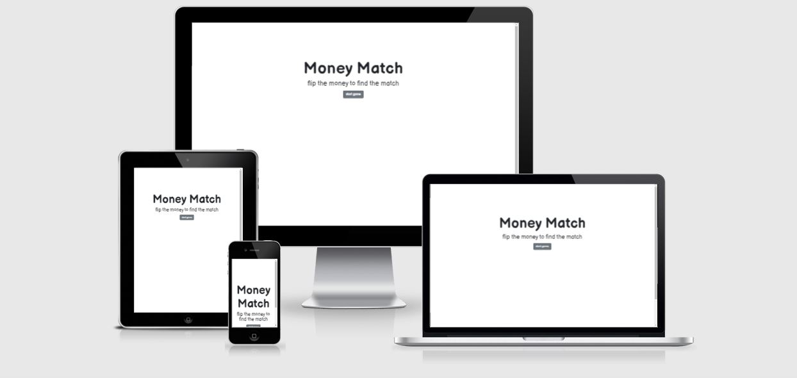

<h1 align="center">Milestone Project 2 - Money Match - Ant Romano</h1>

[View the live project here.](https://antfromano.github.io/milestone-project-2/)

An interactive matching game site designed using HTML, CSS, Bootstrap and JavaScript to highlight skills learned during Full Stack Software Development coursework.

<h2 align="center"></h2>

## User Experience (UX)

Designed to provide a user experience for Potential Employers, recruiters and future collaborators to highlight software development skills combining a resume project with a concise comic book
aesthetic while providing links to project examples using a clean simple accessible and visually interesting format.

-   ### User stories

    -   #### Potential Employer Goals

        1. As a Potential Employer, I want to evaluate Ant Romano's Full Stack Software Development skills through a live website and it's corresponding code and documentation.
        2. As a Potential Employer, I want to locate their social media links to evaluate their relevant social media.
        3. As a Potential Employer, I want a simple format to contact with regards to job opportunities.
        
        
    -   #### Recruiter Goals

        1. As a Recruiter, I want to evaluate and share with potential employers Ant Romano's Full Stack Software Development skills through a live website and its corresponding code and documentation.
        2. As a Recruiter, I want to locate their social media links to evaluate their relevant social media.
        3. As a Recruiter, I want a simple format to with regards to job opportunities.

        
    -  #### Future Collaborator Goals
        1. As a Future Collaborator, I want to evaluate Ant Romano's Full Stack Software Development skills through a live website and it's corresponding code and documentation.
        2. As a Future Collaborator, I want to locate their social media links to evaluate their relevant social media.
        3. As a Future Collaborator, I want a simple format to with regards to projects.

        

-   ### Design
    -   #### Color Scheme
        -   The main colors used are black, gray and white.
    -   #### Typography
        -   The Balsamiq Sans font is the main font used throughout the whole website with Sans Serif as the fallback font in case for any reason the font isn't being imported into the site correctly.
    -   #### Imagery
        -   Utilized HTML, CSS, Javascript and Bootstrap.
        -   Bill images obtained [here](https://www.webnots.com/icon-to-image-converter/icon/money) and resized [here](https://online-photo-converter.com/resize-photo)

*   ### Wireframes

    -   The Balsamiq Cloud Wireframe providing framework for development is accessible [here](https://github.com/antfromano/milestone-project-2/blob/e4849dc31940bdcd2ccdc165cd128a89167c7342/docs/wireframe_from_balsamiq.pdf.pdf)

## Features

-   Responsive on all device sizes

-   Attractive, efficient and interactive elements

## Features Left to Implement/Other Feature Ideas

-   Countdown timer, score keeper, and winner display.

## Technologies

### Languages

-   [HTML5](https://en.wikipedia.org/wiki/HTML5)
-   [CSS3](https://en.wikipedia.org/wiki/Cascading_Style_Sheets)
-   [JavaScript](https://en.wikipedia.org/wiki/JavaScript)

### Frameworks, Libraries & Programs

1. [Bootstrap:](https://getbootstrap.com/)
    - for structure and layout.
1. [Google Fonts:](https://fonts.google.com/)
    - for implementation fonts.
1. [Font Awesome:](https://fontawesome.com/)
    - for simple implementation of icons/ci_logo_small.
1. [GitHub:](https://github.com/antfromano/milestone-project-2)
    - as a repository, distributed version-control system for tracking changes and to deploy and host final version of code.
1. [Gitpod:](https://gitpod.io/)
    - as a collaborative development environment.
1. [Balsamiq:](https://balsamiq.com/)
    - Balsamiq was used to create the [wireframes](https://github.com/antfromano/milestone-project-2/blob/e4849dc31940bdcd2ccdc165cd128a89167c7342/docs/wireframe_from_balsamiq.pdf.pdf) during the design process.
    
## Testing

The W3C Markup Validator and W3C CSS Validator Services were used to validate every page of the project to ensure there were no syntax errors in the project.

-   [W3C Markup Validator](https://validator.w3.org/) - [Results](https://github.com/antfromano/milestone-project-2/blob/e4849dc31940bdcd2ccdc165cd128a89167c7342/docs/results_Nu_Html_game_results.pdf)
-   [W3C CSS Validator](https://jigsaw.w3.org/css-validator/) - [Results](https://github.com/antfromano/milestone-project-2/blob/e4849dc31940bdcd2ccdc165cd128a89167c7342/docs/W3C_CSS_Validator%20results.pdf)

Lighthouse was also used to validate the project for performance, accessability, best practices and SEO.

-   [Lighthouse](https://developers.google.com/web/tools/lighthouse) - [Desktop Results](https://github.com/antfromano/milestone-project-2/blob/f798d64ba05a86875949822a56bae3a264a1df1f/docs/Lighthouse_game_desktop_summary.pdf)

-   [Lighthouse](https://developers.google.com/web/tools/lighthouse) - [Mobile Results](https://github.com/antfromano/milestone-project-2/blob/f798d64ba05a86875949822a56bae3a264a1df1f/docs/Lighthouse_game_mobile_summary.pdf)

JShint was also used to validate every page of the project to ensure there were no JavaScript errors in the project.

-   [JSHint](https://jshint.com/) - [Results](https://github.com/antfromano/milestone-project-2/blob/e4849dc31940bdcd2ccdc165cd128a89167c7342/docs/JSHint_results.pdf)

### Testing User Stories from User Experience (UX)

-   #### Potential Employer Goals

    1. As a Potential Employer, I want to evaluate Ant Romano's Full Stack Software Development skills through a live website and it's corresponding code and documentation.

        1. Upon entering the site, users are automatically greeted with a clean and easily readable navigation bar to go to the page of their choice. Underneath there is simple introduction, Hero Images with Text and social media links.
        2. The main points are made immediately with the introduction and hero images.
        3. The user has three options, click the navigation buttons, hero image links or social media links, all of which will lead provide an opportunity to evaluate software development skills.
 
    2. As a Potential Employer, I want to locate their social media links to evaluate their relevant social media.

        1. The site has been designed to be simple to navigate. 
        2. At the bottom of each page there are social media links and each link is easily identifiable.
        3. Each social media link opens up in a new page for evaluation.

    3. As a Potential Employer, I want a simple format to contact with regards to job opportunities.
        1. Once the Potential Employer has read the Home, Skills and Project pages, they will notice the Contact page.
        2. The user can easily utilize the navigation bar on every page to reach the Contact page.
        3. The Contact page allows for the Potential Employer to simply provide their name, email and applicable message regading potential job opportunities.

### Further Testing

-   Tested on Google Chrome, Internet Explorer and Microsoft Edge.
-   Viewed on variety of devices such as Desktop, Chromebook and Pixel XL.
-   Testing was done to ensure that all pages linked correctly.
-   Friends and family were asked to review site and documentation for any bugs and/or user issues.
-   Attempted to click bills in excess of two times and was unable to.
-   Tested start game, restart and back buttons extensively.

### Known Bugs

-   On some mobile devices the headings on index.html and game board on game.html aren't fully centered.
-   On some mobile devices the images on the game board on game.html are blurier than on larger screens.

## Deployment

### GitHub Pages

Project was deployed to GitHub Pages with the following steps...

1. Log in GitHub and locate [GitHub Repository](https://github.com/)
2. At top of Repository, locate "Settings" Button.
    - [Here](https://raw.githubusercontent.com/) is a GIF demonstrating the process.
3. Scroll down Settings page to"GitHub Pages".
4. Under "Source", click dropdown "None" and select "Master Branch" which automatically refresh the page.
5. Scroll down to the newly published site [link](https://github.com) in "GitHub Pages" section.

### Forking the GitHub Repository

Forking the GitHub Repository makes an original repository copy on oGitHub account for viewing and/or making changes but not affecting original repository achieve with the following steps.

1. Log in GitHub and locate [GitHub Repository](https://github.com/)
2. At top of Repository, locate "Fork" Button where there is now a copy of original repository.

### Making a Local Clone

1. Log in GitHub and locate [GitHub Repository](https://github.com/)
2. Under repository name, select "Clone or download".
3. For cloning repository using HTTPS copy the link under "Clone with HTTPS".
4. Open Git Bash and modify current working directory to location of your preferred cloned directory.
5. Input `git clone`, and paste copied URL from Step 3.

```
$ git clone https://github.com/antfromano/milestone-project-2
```

6. Press Enter. Local clone is created.

```
$ git clone https://github.com/antfromano/milestone-project-2
> Cloning into `CI-Clone`...
> remote: Counting objects: 10, done.
> remote: Compressing objects: 100% (8/8), done.
> remove: Total 10 (delta 1), reused 10 (delta 1)
> Unpacking objects: 100% (10/10), done.
```

Click [Here](https://help.github.com/en/github/creating-cloning-and-archiving-repositories/cloning-a-repository#cloning-a-repository-to-github-desktop) to retrieve pictures for some of the buttons and more detailed explanations of the above process.

## Credits

### Code

-   [Bootstrap](https://getbootstrap.com/): Bootstrap Library used to make site responsive.

-   [Memory Game](https://www.freecodecamp.org/news/vanilla-javascript-tutorial-build-a-memory-game-in-30-minutes-e542c4447eae/): JavaScript concepts used to develop match game.

### Content

-   All content was written by the developer.

-   The format for README.md was taken from [here](https://github.com/Code-Institute-Solutions/SampleREADME/blob/master/README.md)

### Media

-   ch-ching.wav audio created by hgernhardt - https://freesound.org/ from [here](https://freesound.org/people/hgernhardt/sounds/402651/)

### Acknowledgements

-   Mentorship and guidance provided by Aaron Sinnott from Code Institute

-   Tutor support at Code Institute for their support.

-   I received inspiration for this project from Marina Ferreira and Amy Keedwell.